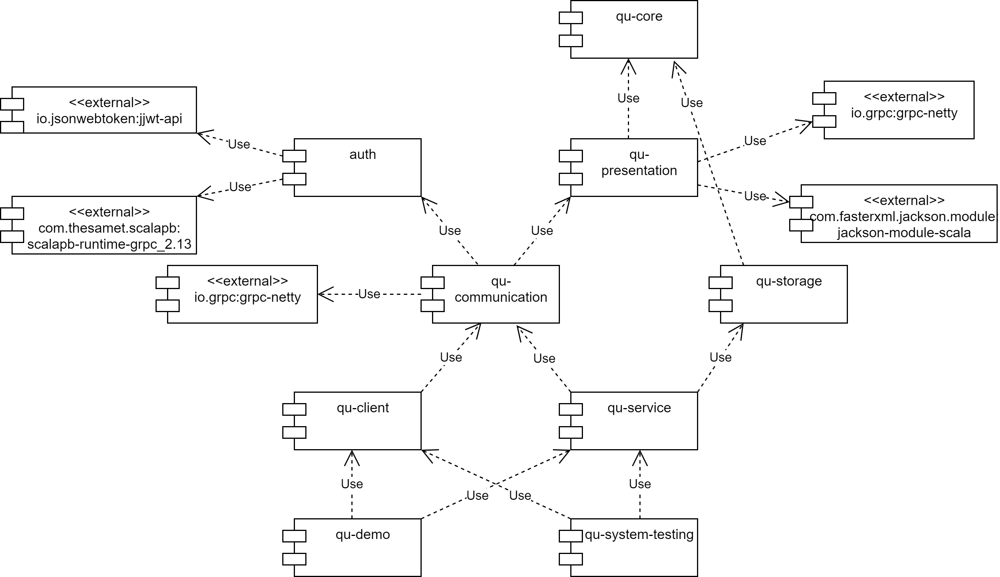

# BFT Query/Update protocol

## Introduction


This repository contains an implementation of the Q/U protocol, a tool that enables construction of fault-scalable
Byzantine fault-tolerant services by an operations-based interface with a focus on fault-scalability, described by
authors in the paper [Fault-Scalable Byzantine Fault-Tolerant Services](https://cs.brown.edu/courses/csci2950-g/papers/qu.pdf).

Developed in gRPC and scala with a strongly modular approach, it's available in this repo either as:

- an extensible and reusable scala library, providing an access point to Q/U's client and service functionalities,
- a command line, demo application implementing a simple Replicated State Machine (RSM) for showcasing its potentialities and acting as an example for the construction of more complex services.

## Features

---------------	

The paper's provided features covered by the library are (refer to the above-mentioned paper for the terminology):

- single-object update basic functioning:
    - clients authentication/authorization
    - query and update submission
    - threshold quorum construction with recursive thresholds quorum constructions
    - Replica History integrity check by HMAC
    - client and service broadcast for quorum construction
    - client's retry and random exponential backoff policy (repair)
    - object syncing at server

- Optimizations:
    - compact timestamp
    - replica history pruning
    - optimistic query execution
    - handling repeated request at the server
    - inline repair
    - caching of Object History Set

Additionally, the library features also:

- async revisiting of Q/U protocol, by providing non-blocking client and service APIs leveraging scala's Future
- strong type check at compile time by leveraging scala's strong statically typed type-system
- JSON Web Token (JWT) based authentication
- JSON (de)serialization by [Jackson](https://github.com/FasterXML/jackson-module-scala)
- prototype implementations of ready-made remote data structures
- gRPC-compatible and -aware Q/U service APIs access for a more custom approach

Refer to [issues page](https://gitlab.com/pika-lab/courses/ds/projects/ds-project-giulianini-ay1920/-/issues) for a
deeper overview of the main functionalities.

## Project organization


To ease management and future extensions, the project is organized in the set of inter-dependent subprojects depicted in the following image and described below:



1. qu-core: it defines base entities, data structures and algorithms upon which the protocol is built.
2. qu-presentation: it defines the (de)serialization logic corresponding to layer 6 of ISO-OSI stack for exchanging messages between clients and replicas involved in the protocol.
3. auth: a simple and reusable token(JWT)-based authentication and authorization module, generically modelling user's info, its roles and its credentials and exposing client and server side APIs.
4. qu-communication: it contains the common abstractions for communication and interaction between the clients and servers.
5. qu-client: it contains Q/U client-side configuration and protocol-execution logic. It also hosts a prototype implementation of the client side of some reusable, distributed, data structures.
6. qu-service: it holds the service-side logic of the protocol, together with the service side counterpart of some common remote data structures.
7. qu-storage: it isolates the storage-specific logic.
8. qu-demo: it hosts the RSM implementation accessible by a command line interface.
9. qu-system-testing: a module for the system testing (or specification) of the protocol in order to validate it.


## How to deploy


### Library

#### For sbt users

##### Prerequisites:

- Scala 2.13.8
- Java 11
- Sbt 1.6.2
- Git

At the moment, the library is not available on a public remote repository (like Maven Central, for example). So, the steps below show how to public it locally.

1. clone the repo into the desired folder:

```bash
    git clone https://gitlab.com/pika-lab/courses/ds/projects/ds-project-giulianini-ay1920
```

2. move inside the downloaded folder:

```bash
    cd ds-project-giulianini-ay1920
```

3. publish the library on a local repository:

```bash
    sbt publishLocal
```

4. add the dependencies of interest to your build.sbt; for client and service functionalities they are the following:

```scala
   libraryDependencies ++= Seq(
  "org.unibo" %% "ds-project-giulianini-ay1920" % "1.0.0",
  "org.unibo" %% "quClient" % "1.0.0"
  "org.unibo" %% "quService" % "1.0.0"
)
```

### Demo

#### Prerequisites:

- Git
- Docker

To ease the deployment of the command line demo app a Dockerfile is provided. Therefore, to use it:

1. clone the repo into the desired folder:

```bash
    git clone https://gitlab.com/pika-lab/courses/ds/projects/ds-project-giulianini-ay1920
```

2. move inside the downloaded folder:

```bash    
    cd ds-project-giulianini-ay1920
```

3. build the image of the demo app by running:

```bash
    docker build -t qu-cli-demo .
```

4. run the app with:

```bash
    docker run -it --name <container-name> qu-cli-demo
```

5. After exiting the app, remove the container by referring to the name provided before:

```bash
    docker rm <container-name>
```

## How to use

### Library

To showcase the Q/U library APIs, in the following how to build up a fault-scalable and fault-tolerant service, providing
a remote counter exposing these methods, is shown:

1. Value: get the current value of the distributed counter
1. Increment: increase the d. counter value by one
1. Decrement: decrease the d. counter value by one
1. Reset: reset the d. counter to the initial value zero

This remote counter abstraction is presented here for demonstration purpose, but it has been already implemented in
the repo so reuse it if actually needed.

#### Replicated State Machine (RSM) Operations definition

As Q/U follows an SMR approach, the first step to build up a service is to declare the operations of the RSM. Queries (which does not modify the object state) must extend Query, while updates, Update.
It's possible to reuse here some ready-made abstractions and utilities available on [Operations](qu-core/src/main/scala/qu/model/Operations.scala).

```scala
object Value extends QueryReturningObject[Int]

case class Increment() extends UpdateReturningUnit[Int] {
  override def updateObject(obj: Int): Int = obj + 1
}

case class Decrement() extends UpdateReturningUnit[Int] {
  override def updateObject(obj: Int): Int = obj - 1
}

case class Reset() extends UpdateReturningUnit[Int] {
  override def updateObject(obj: Int): Int = 0
}
```

#### Quorum thresholds setting

Before running clients or replicas, the quorum thresholds need to be set according to the worst-case faults' scenario to
face in your distributed system. Here, we want to tolerate up to two replica fails, one of which of byzantine nature.

```scala
import qu.model.QuorumSystemThresholds

val thresholds = QuorumSystemThresholds(t = 2, b = 1)
```

#### Auth server setup and start

Since Q/U requires authentication, an auth server needs to be started up before issuing client requests. Create it by
specifying to the factory method the port to be listening on and the Execution context responsible for requests
processing.

```scala
val authServerSocketAddr = SocketAddress("localhost", 1006)

import scala.concurrent.ExecutionContext.Implicits.global
import qu.auth.server.AuthServer

val authServer = new AuthServer(authServerSocketAddr.port)
authServer.start()
```

#### Replica setup and start

To process requests, a number of replicas coeherent with thresholds chosen must be setup and started.
For each of them (in the following we do it for the first replica), configure a builder instance by specifying its port
and address (either passed separately or inside a SocketAddress container) from which to receive requests, its private
key to generate authenticators for Replica History integrity check, the thresholds and the initial object state.
Then, plug the relevant info for all the replicas making up the cluster; namely, their:

1. ip/port (or SocketAddress),
1. the private key for RH integrity validation shared with the one under construction.

Then, register the outputs of each operation to submit. It's important to register all the operations at all the replicas; otherwise, a client receives a OperationOutputNotRegisteredException when interacting with them.

```scala
import qu.service.QuServerBuilder
import qu.service.AbstractGrpcQuService.ServerInfo

val quReplica1Info = ServerInfo(ip = "localhost", port = 1001, "ks1s1")
val quReplica2Info = ServerInfo(ip = "localhost", port = 1002, "ks1s2")
//...
val quReplica6Info = ServerInfo(ip = "localhost", port = 1006, "ks1s6")

val quServer = QuServerBuilder(quReplica1Info, thresholds, 0)
  .addServer(quReplica2Info)
  //…
  .addServer(quReplica6Info)
  .addOperationOutput[Int]() //for Value
  .addOperationOutput[Unit]() //for Inc, Dec, Reset
  .build
```

Finally, start each replica ensuring an ExecutionContext is available in scope.

```scala
quServer.start()
```

#### Q/U client authentication

The library splits authentication APIs from actual operations-submissions interface. So, let's register (if not done
before) and authenticate your client after passing to the corresponding factory method the ip, port of the auth server, username and password and an implicit ExecutionContext as well. Methods' return values of type Future enable monadic chaining so for
comprehension can be exploited. Authorization will end up returning a builder for setting up the actual Q/U client.

```scala
import qu.client.AuthenticatingClient

val quServer1SocketAddr: SocketAddress = SocketAddress(ip = "localhost", port = 1000)
val quServer2SocketAddr: SocketAddress = SocketAddress(ip = "localhost", port = 1001)
//...
val quServer6SocketAddr: SocketAddress = SocketAddress(ip = "localhost", port = 1003)

val authClient = AuthenticatingClient[Int](
  authServerSocketAddr.ip,
  authServerSocketAddr.port,
  "username",
  "password")
val authenticatedQuClientBuilder = for {
  _ <- authClient.register()
  builder <- authClient.authorize()
} yield builder

```

#### Q/U client configuration

Now, set the thresholds and each of the replicas up by providing the builder with their ip and port. The call to
build will provide a Q/U client after a validation step.

```scala
val authenticatedQuClient =
  for {
    builder <- authenticatedQuClientBuilder
  }
  yield builder.addServer(quServer1SocketAddr)
    //...
    .addServer(quServer6SocketAddr)
    .withThresholds(thresholds).build
```

#### Operations submission

It's now possible to submit operations to the replicas by issuing them to the obtained client. As for authentication
APIs, for comprehension can be exploited to sequentialize operations.

```scala
for {
  authenticatedQuClient <- authenticatedQuClient
  _ <- authenticatedQuClient.submit[Unit](Increment())
  _ <- authenticatedQuClient.submit[Unit](Reset())
  _ <- authenticatedQuClient.submit[Unit](Increment())
  _ <- authenticatedQuClient.submit[Unit](Increment())
  _ <- authenticatedQuClient.submit[Unit](Decrement())
  value <- authenticatedQuClient.submit[Int](Value)
} yield println("distributed counter value is:" + value)
```

#### Client shutdown

After finishing submitting operations, QuClient, as well as AuthenticatingClient, must be shutdown to clean up resources.
Be sure to wait until future completes before exiting application.

```scala
authClient.shutdown()
authenticatedQuClient.map(_.shutdown())
```

#### Client sync APIs counterpart

Even if the presented way of interacting with the library is the suggested, the following synchronous approach could be
exploited too, thanks to scala's Future support.

```scala
import scala.concurrent.Await
import scala.concurrent.duration.DurationInt

Await.ready(authClient.register(), atMost = 1.seconds)
val maxWait = 30.seconds
val quClientBuilder = Await.result(authClient.authorize(), atMost = 1.seconds)
val authenticatedSyncQuClient = quClientBuilder.addServer(quServer1SocketAddr)
  //...
  .addServer(quServer6SocketAddr)
  .withThresholds(thresholds).build

Await.ready(authenticatedSyncQuClient.submit(Increment()), atMost = maxWait)
Await.ready(authenticatedSyncQuClient.submit(Reset()), atMost = maxWait)
Await.ready(authenticatedSyncQuClient.submit(Increment()), atMost = maxWait)
Await.ready(authenticatedSyncQuClient.submit(Decrement()), atMost = maxWait)
Await.ready(authenticatedSyncQuClient.submit(Reset()), atMost = maxWait)
Await.ready(authenticatedSyncQuClient.submit[Int](Value), atMost = maxWait)

val syncValue = Await.ready(authenticatedSyncQuClient.submit[Unit](Increment()), atMost = maxWait)
println("distributed counter value is:" + syncValue)

Await.ready(authClient.shutdown(), 1.seconds)
Await.ready(authenticatedSyncQuClient.shutdown(), 1.seconds)
```

#### Replica and Auth server shutdown

Finally, shutdown auth server and replicas for stopping them and freeing up allocated resources. Be sure to wait until
corresponding future completes before exiting application.

```scala
authServer.shutdown()
quServer.shutdown()
```


#### Ready-made remote data structures
Although very prototypical, it's actually possible to leverage some ready-made remote data structures that allow you to avoid most of the boilerplate. See [this example code](qu-system-testing/src/main/scala/qu/UsageExampleCodeDataStructure.scala) and [demo code](qu-demo/src/main/scala/qu/model/SmrSystemImpl.scala) for how to use them.

#### gRPC-aware Q/U services
To:
   1. reuse an existing gRPC server
   2. ease the library APIs understanding by relying on already got know-how on gRPC
   3. allow a higher level of customization

you can plug Q/U replicas functionalities into a gRPC server. 

First, create a Q/U service by providing the service builder factory the relevant configuration:

1. the MethodDescriptorFactory in charge of (de)serializing client-replicas and replicas-replicas messages. The lib leverages Jackson, but others can be easily used, as long as it is compatible with the one adopted at client side.
2. the Higher-Order ServerQuorumPolicy used by the replica when performing object sync. The repo contains one implementation but new can be easily added.
3. ip assigned to the server the service will be running on
4. port assigned to the server the service will be running on
5. the private key by which to generate authenticators to check integrity of Replica Histories
6. the initial state of the object to replicate
7. the thresholds for the system
8. the storage for object versions. The repo contains one in-memory implementation but new (especially disk-backed) can be easily added.

```scala
import qu.service.AbstractGrpcQuService.QuServiceBuilder
import qu.service.JwtAuthorizationServerInterceptor
import qu.service.quorum.JacksonBroadcastBroadcastServerPolicy
import qu.storage.ImmutableStorage

import com.fasterxml.jackson.module.scala.JavaTypeable
import io.grpc.{Grpc, InsecureServerCredentials}
import presentation.CachingMethodDescriptorFactory
import qu.SocketAddress.id

val quService = new QuServiceBuilder(
  methodDescriptorFactory = new JacksonMethodDescriptorFactory with CachingMethodDescriptorFactory[JavaTypeable] {},
  policyFactory = JacksonBroadcastBroadcastServerPolicy[Int](_, _),
  ip = quReplica1Info.ip,
  port = quReplica1Info.port,
  privateKey = quReplica1Info.keySharedWithMe,
  obj = 0,
  thresholds = thresholds,
  storage = ImmutableStorage[Int]()).build
```

Then, inject it in the gRPC server by providing:
1. the port to be listening on
2. the ServerCredentials. Currently, only plain communication is implemented, but it's easy to plug other gRPC already-provided mechanisms or even custom ones.
3. the authorization interceptor in charge of checking the client authentication (a JWT-based approach is provided but new can be easily added as long as it is compatible with the one adopted by the CallCredentials used at client side).
4. the Q/U service just built
```scala
Grpc.newServerBuilderForPort(quReplica1Info.port, 
  InsecureServerCredentials.create()) //ServerBuilder.forPort(quReplica1Info.port)
        .intercept(new JwtAuthorizationServerInterceptor())
        .addService(quService)
        .build
```

As already mentioned, it's also possible to plug a new authorization or serialization technology as well.

For more insights on how to use the library see [client specification](qu-client/src/test/scala/qu/client), [service specification](qu-service/src/test/scala/qu/service), [overall system specification](qu-system-testing/src/test/scala/qu) or [demo code](qu-demo/src/main/scala/qu).


### Demo

The demo app allows the user to interact with a distributed counter backed by an already set up cluster made of five Q/U
replicas (the minimum required to tolerate one byzantine server) via a predefined set of commands.

On startup, the list of commands, split in counter-related operations and cluster-management ones, is shown.

```bash
$ docker run -it --name quCliApp qu-cli-demo
Q/U protocol example SMR System
commands summary:
command             argument            description         
prof                                    show servers statuses.
value                                   get the value of the distributed counter.
help                                    show cli commands list.
reset                                   reset the distributed counter.
exit                                    shutdown the SMR system.
kill                <server>            shutdown a single server replica for simulating fault.
dec                                     decrement the value of the distributed counter.
inc                                     increment the value of the distributed counter.
```

Regarding counter-related operations, to increment the value of the remote counter, decrement or reset it, issue
the `inc`, `dec` or `reset` commands, respectively.

```bash
$ inc
operation completed correctly. 
$ inc
operation completed correctly. 
$ dec
operation completed correctly. 
$ reset
operation completed correctly. 
$ inc
operation completed correctly. 
```

To get its current value, digit `value`.

```bash
$ value
operation completed correctly. Updated counter value is: 1
```

Regarding cluster-management operations, it's possible to get the current status of each of the replicas by
performing `prof`.

```bash
$ prof
operation completed correctly. Servers statuses are:
localhost:1001 -> active
localhost:1002 -> active
localhost:1003 -> active
localhost:1004 -> active
```

While all running at the beginning, you can simulate a crash fault affecting any of them by running `kill <id>`.

```bash
$ kill localhost:1001
operation completed correctly. Server localhost:1001 stopped. Servers statuses are:
localhost:1001 -> shutdown
localhost:1002 -> active
localhost:1003 -> active
localhost:1004 -> active
```

Be careful to not exceed thresholds by failing more than one server for not breaking protocol semantics.

```bash
kill localhost:1002
a problem raised up. Quorum System thresholds, which guarantee the correct protocol semantics, would be exceeded.
```

Don't kill a server twice too: in the case the app will inform you.

```bash
kill localhost:1001
a problem raised up. Server already previously killed, can't kill it twice.
```

Make sure the replica id is spelled right.

```bash
$ kill badId
a problem raised up. Server id not valid. Server not existing.
```

A check on the syntax of the issued command is included.

```bash
$ badCmd
command not recognized. Please attain to the syntax, digit help to display commands.
```

You can always retrieve commands list by running `help`.

```bash
$ help
commands summary:
command             argument            description         
prof                                    show servers statuses.
value                                   get the value of the distributed counter.
help                                    show cli commands list.
reset                                   reset the distributed counter.
exit                                    shutdown the SMR system.
kill                <server>            shutdown a single server replica for simulating fault.
dec                                     decrement the value of the distributed counter.
inc                                     increment the value of the distributed counter.
```

Finally, to close the application releasing all the resources, digit `exit`.

```bash
$ exit
quitting...
```